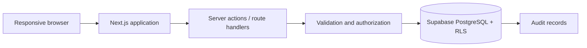

# Architecture

## Proposed system shape

Suivora should begin as one Next.js repository and one PostgreSQL database. The browser renders the responsive French-first UI; server-side application boundaries validate commands and enforce permissions; Supabase supplies PostgreSQL, authentication, and row-level security. Vercel is the proposed application host.



This is a proposed technical design, not an implemented system.

## Proposed stack

Next.js 16, React 19, strict TypeScript, App Router, Tailwind CSS, shadcn/ui, Lucide, PostgreSQL, Supabase and Supabase Auth/RLS, Zod, React Hook Form, Vitest, React Testing Library, Playwright, and Vercel.

The implemented production validation uses `next build --webpack`. This is a supported Next.js 16 compiler path selected because the managed environment blocks the internal port used by the Turbopack CSS worker; it does not change the application runtime or add a dependency.

PostgreSQL fits the strongly relational, tenant-scoped domain and its reporting needs better than MongoDB. Microservices would add operational and consistency cost without benefit at pilot scale.

Student identity and class membership are normalized: `students` is the school-owned identity, while `enrollments` records immutable class/year/start identity and an optional closing date. Composite foreign keys enforce tenant/year ownership, a locked school-year validation trigger enforces date boundaries, and an inclusive `daterange` exclusion constraint provides concurrency-safe overlap prevention.

The student application boundary uses four `SECURITY DEFINER` RPCs rather than coordinating dependent writes in React or Server Actions. Each derives the active ADMIN school through `auth.uid()`, validates protected parents, and uses deterministic row locks. PostgreSQL statement atomicity rolls back student creation or enrollment transfer completely when a dependent write fails.

## Code organization principles

- Feature-first modules with domain, application, persistence, and UI concerns separated where useful
- Pure, language-independent domain calculations outside React
- Server-only persistence modules and privileged credentials
- Explicit schemas at trust boundaries
- Localization keys at every user-facing surface
- Stable domain enums mapped to translated presentation labels
- Minimal dependencies and accessible responsive components

A detailed directory tree is intentionally deferred until repository bootstrap.

## Localization request flow

The implemented next-intl 4.14 integration uses Next.js 16.3's `next/root-params` convention rather than the legacy `setRequestLocale` pattern. Separate root layouts keep the explicit `/` redirect and the locale parameter at the localized document root:

```text
/ → application redirect → /fr
/fr → [locale] validation → request config → fr.json → server translations
unknown locale → [locale] validation → 404
```

`src/i18n/routing.ts` owns the immutable `fr`/`tr` locale tuple, `Locale` type, French default, validation helper, and typed navigation configuration. `src/i18n/request.ts` validates the root locale parameter and loads its server-side catalog. The next-intl plugin connects that request configuration to Next.js. One client-side switcher at the localized root changes only the leading locale segment and drops query data; pages, metadata, authorization, and business navigation remain shared and server-first. Localized not-found boundaries use the active catalog.

`src/proxy.ts` now uses the Next.js 16 proxy convention only for `/fr/connexion` and `/fr/app/:path*`. It refreshes Supabase Auth cookies and excludes static/internal assets by using this narrow allow-list; it performs no locale negotiation, role lookup, school lookup, or application-table query. The root redirect and unsupported-locale 404 behavior remain application-owned.

## Supabase connection boundaries

`src/lib/env/public.ts` is the only reader of the two public Supabase environment variables. It validates supplied input independently with Zod and exposes an immutable configuration. Validation is lazy: importing the application or rendering unrelated pages does not require credentials, while requesting either client fails with a clear error if configuration is absent or invalid.

`src/lib/supabase/browser.ts` uses `createBrowserClient` and caches one browser-runtime client so repeated component renders do not construct unnecessary clients. It receives only the public URL and publishable key and imports no Next.js server API.

`src/lib/supabase/server.ts` is marked server-only, awaits the Next.js 16 cookie store, and creates a new `createServerClient` for each request context. Its `getAll`/`setAll` adapter permits cookie writes in Server Actions and Route Handlers and tolerates only the framework's read-only Server Component cookie boundary. `src/lib/supabase/proxy.ts` mirrors refreshed cookies onto both request and response and calls the server-verified Auth identity endpoint rather than trusting `getSession()`.

Authentication mutations are Server Actions. A pure application boundary validates and normalizes credentials with Zod, maps provider failures to stable non-sensitive codes, and restricts return paths to the active locale's `/app` subtree. The sign-in page verifies identity with `getUser()`.

The protected application layout calls a server-only application-context resolver. It creates one request-scoped Supabase client, verifies identity with `getUser()`, reads the caller's active `user_profiles` row through RLS, then reads the related school through RLS. React request caching avoids duplicate Auth/profile/school work when a nested module page repeats the authorization boundary. The safe returned context contains only user ID for internal server authorization, the validated `ADMIN`/`TEACHER` role, and school ID/name; identifiers and email are never rendered. Missing/inactive profiles, inaccessible schools, unsupported roles and provider failures fail closed to a generic localized state with local sign-out.

The responsive application shell is a Server Component. Its centralized typed navigation configuration selects ADMIN or TEACHER links; only the active-link renderer is a small Client Component because it needs the current pathname. `/fr/app/[module]` is a shared localized placeholder boundary that rechecks the server context and rejects a role-inappropriate manual path. Navigation visibility remains presentation, never authorization.

At the local database layer, RLS derives school and role from the active `user_profiles` row matching `auth.uid()`. Three minimal security-definer helpers bypass profile RLS solely to avoid policy recursion and expose only school, role, or an admin boolean. PostgreSQL grants permit the minimum table/column operations, while eight policies independently enforce own-school visibility and admin-only year/term writes. Application repositories and server-side role decisions remain future work; RLS is not replaced by UI or application checks.

Future application code should call typed repositories/query modules built above the request-scoped server factory. A connection and publishable key do not authorize any school data: server authorization and PostgreSQL RLS remain independent requirements. No service-role/secret client exists because this task has no elevated operation and ordinary application access must not bypass RLS.

## Data and consistency

The application database becomes authoritative after Excel import. Mutations that affect shared academic state should be transactional where partial application would be harmful. Calculated suggestions and human decisions remain distinct. Contact history is append-only; other high-value edits retain auditable before/after context or an equivalent event representation.

## Local database workflow

Supabase CLI 2.116.0 is pinned as a development dependency. Version-controlled configuration lives in `supabase/config.toml`, forward migrations in `supabase/migrations/`, and the deliberately empty local seed boundary in `supabase/seed.sql`. Local development runs through Docker-backed npm scripts; no global CLI, project link, or remote schema command is part of this foundation.

The initial migration creates the tenant root and academic-calendar boundary only. It uses UUID keys, `timestamptz` audit columns, one shared update trigger, explicit constraints, and tenant-preserving foreign keys. The generated `Database` contract in `src/types/database.generated.ts` is produced from the running local schema and parameterizes both Supabase client factories.

All application tables enable RLS immediately. The local authorization migration adds narrowly tested policies and grants while preserving anonymous denial and deferred deletes/profile provisioning. Local migrations follow: create migration, reset, lint, test, generate types, and reset again. Remote application remains a separate reviewed operation.

## Derived projections and persistent workflows

Mandatory-study requirements, study sessions, academic events, event audiences/reminders, and personal tasks are persistent domain records. Study and shared-event changes are auditable; personal reminders/tasks are owner-private.

By contrast, automatic “À faire aujourd’hui” items should be composed by a proposed `TeacherActionCenter` application service from authoritative grades, student evolution, study requirements, progression, homework alerts, and events. The projection applies source-level authorization, stable identifiers, deterministic priorities, and deterministic disappearance rules. It must not copy source state into stale generic task records. Only teacher-created personal tasks require persistent task records.

This projection is intentionally scheduled after its source modules in the development plan and does not affect Milestone A.

## Scale and evolution

Pilot scale does not justify distributed services. Add indexes from real query patterns, paginate histories, and keep every school-owned row tenant-scoped. Future schools should use the same tenant boundary rather than require a schema rewrite.

## Decision management

Material architecture choices should receive a record under `docs/decisions/`; see its README. Unresolved product choices remain in `open-decisions.md`.

## ADMIN calendar feature boundary

Task 08C uses a feature-first `calendar` boundary. Pure parsing and date rules live in `src/features/calendar/calendar.ts`; request-scoped reads live in `data.ts`; reauthorizing Server Actions live in `actions.ts`; and localized presentation/forms remain separate. The route composes these server-side and keeps the client boundary limited to interactive forms.

## Future teacher invitation boundary

Teacher invitation will use a narrowly isolated, server-only Supabase privileged Auth client inside the future teacher-provisioning server module. Its secret must never use a `NEXT_PUBLIC_` variable, enter browser code, or authorize ordinary academic database operations. The intended sequence is: active ADMIN supplies email and display name, the server sends an Auth invitation, then passes only the returned Auth user ID and validated name to the protected provisioning RPC. The invited teacher establishes their own password; administrators never choose or store it.

Invitation and profile creation cannot be one cross-system transaction. The future workflow must be idempotent and define reconciliation when invitation succeeds but provisioning fails. Existing Auth identities must never be deleted as compensation, and raw Auth errors or teacher emails must not be logged.

## Implemented teacher-management boundary

Task 09C implements the ADMIN-only `/fr/app/enseignants` module. Same-school TEACHER profiles are listed through RLS, every Server Action re-resolves the active ADMIN context, and profile mutations call only the protected RPCs. The secret-backed client is isolated in `src/lib/supabase/privileged.ts`, has no cookies or persistent session, and is imported only by the teacher provisioning server module.

Invitation success followed by an RPC error is reconciled through the normal authenticated database boundary. Only an Auth identity returned by that exact request can be deleted once as compensation. `/auth/confirm` verifies invitation OTPs with the cookie-aware SSR client and allows only `/fr/activation`; activation accepts only active TEACHER profiles and stores passwords only through Supabase Auth.

## Development deployment boundary

The dedicated public GitHub repository `kivancbeser/Suivora` drives the dedicated Vercel project `suivora` from `main`. Its stable production alias is `https://suivora.vercel.app`; branch-specific deployment URLs are never invitation origins. Vercel Production owns the four named environment variables, with `SUPABASE_SECRET_KEY` stored as sensitive. Local development retains `http://localhost:3000` in ignored local configuration. Numeon repositories, projects, domains, and variables are not shared.

## ClassCourse persistence boundary

The relational dependency order is School → SchoolYear → Class → ClassCourse, with Course joining at the ClassCourse boundary. Composite foreign keys enforce school and year ownership independently of application code. Declarative checks and unique indexes enforce normalized names, codes, weekly-period bounds, and concurrency-safe business uniqueness. The tables are typed infrastructure only; feature reads and writes will remain server-side and request-scoped.

Task 10C implements feature-scoped `classes`, `courses`, and `class-courses` modules. Server Components compose reads; small client forms call separately defined Server Actions. Every action resolves the authenticated ADMIN again, accepts only its documented editable fields, loads referenced parents through RLS, and derives `school_id`, `school_year_id`, and initial active state on the server. The privileged Auth client is outside this boundary.
