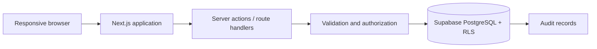

# Architecture

## Proposed system shape

Suivora should begin as one Next.js repository and one PostgreSQL database. The browser renders the responsive French-first UI; server-side application boundaries validate commands and enforce permissions; Supabase supplies PostgreSQL, authentication, and row-level security. Vercel is the proposed application host.



This is a proposed technical design, not an implemented system.

## Proposed stack

Next.js 16, React 19, strict TypeScript, App Router, Tailwind CSS, shadcn/ui, Lucide, PostgreSQL, Supabase and Supabase Auth/RLS, Zod, React Hook Form, Vitest, React Testing Library, Playwright, and Vercel.

PostgreSQL fits the strongly relational, tenant-scoped domain and its reporting needs better than MongoDB. Microservices would add operational and consistency cost without benefit at pilot scale.

## Code organization principles

- Feature-first modules with domain, application, persistence, and UI concerns separated where useful
- Pure, language-independent domain calculations outside React
- Server-only persistence modules and privileged credentials
- Explicit schemas at trust boundaries
- Localization keys at every user-facing surface
- Stable domain enums mapped to translated presentation labels
- Minimal dependencies and accessible responsive components

A detailed directory tree is intentionally deferred until repository bootstrap.

## Localization request flow

The implemented next-intl 4.14 integration uses Next.js 16.3's `next/root-params` convention rather than the legacy `setRequestLocale` pattern. Separate root layouts keep the explicit `/` redirect and the locale parameter at the localized document root:

```text
/ → application redirect → /fr
/fr → [locale] validation → request config → fr.json → server translations
unknown locale → [locale] validation → catalog-backed French 404
```

`src/i18n/routing.ts` owns the immutable locale tuple, `Locale` type, default locale, validation helper, and typed navigation configuration. `src/i18n/request.ts` validates the root locale parameter and loads its server-side catalog. The next-intl plugin connects that request configuration to Next.js. The locale layout provides the smallest shared client-provider boundary while pages and metadata use server translations by default. Root and localized not-found boundaries source visible copy from the same French catalog.

No proxy is necessary for the current deterministic requirements: the root application route redirects explicitly, there is no browser/cookie negotiation, and an unknown first segment must 404 instead of being rewritten under French. If multiple active locales later require negotiation, revisit the current Next.js `proxy.ts` convention explicitly.

## Supabase connection boundaries

`src/lib/env/public.ts` is the only reader of the two public Supabase environment variables. It validates supplied input independently with Zod and exposes an immutable configuration. Validation is lazy: importing the application or rendering unrelated pages does not require credentials, while requesting either client fails with a clear error if configuration is absent or invalid.

`src/lib/supabase/browser.ts` uses `createBrowserClient` and caches one browser-runtime client so repeated component renders do not construct unnecessary clients. It receives only the public URL and publishable key and imports no Next.js server API.

`src/lib/supabase/server.ts` is marked server-only, awaits the Next.js 16 cookie store, and creates a new `createServerClient` for each request context. Its `getAll`/`setAll` adapter permits cookie writes in Server Actions and Route Handlers; it ignores only Next.js's specific read-only-cookie error in Server Components and rethrows unexpected failures. Authentication-session refresh through `proxy.ts` is deferred to the authentication task.

Future application code should call typed repositories/query modules built above the request-scoped server factory. A connection and publishable key do not authorize any school data: server authorization and PostgreSQL RLS remain independent requirements. No service-role/secret client exists because this task has no elevated operation and ordinary application access must not bypass RLS.

## Data and consistency

The application database becomes authoritative after Excel import. Mutations that affect shared academic state should be transactional where partial application would be harmful. Calculated suggestions and human decisions remain distinct. Contact history is append-only; other high-value edits retain auditable before/after context or an equivalent event representation.

## Derived projections and persistent workflows

Mandatory-study requirements, study sessions, academic events, event audiences/reminders, and personal tasks are persistent domain records. Study and shared-event changes are auditable; personal reminders/tasks are owner-private.

By contrast, automatic “À faire aujourd’hui” items should be composed by a proposed `TeacherActionCenter` application service from authoritative grades, student evolution, study requirements, progression, homework alerts, and events. The projection applies source-level authorization, stable identifiers, deterministic priorities, and deterministic disappearance rules. It must not copy source state into stale generic task records. Only teacher-created personal tasks require persistent task records.

This projection is intentionally scheduled after its source modules in the development plan and does not affect Milestone A.

## Scale and evolution

Pilot scale does not justify distributed services. Add indexes from real query patterns, paginate histories, and keep every school-owned row tenant-scoped. Future schools should use the same tenant boundary rather than require a schema rewrite.

## Decision management

Material architecture choices should receive a record under `docs/decisions/`; see its README. Unresolved product choices remain in `open-decisions.md`.
